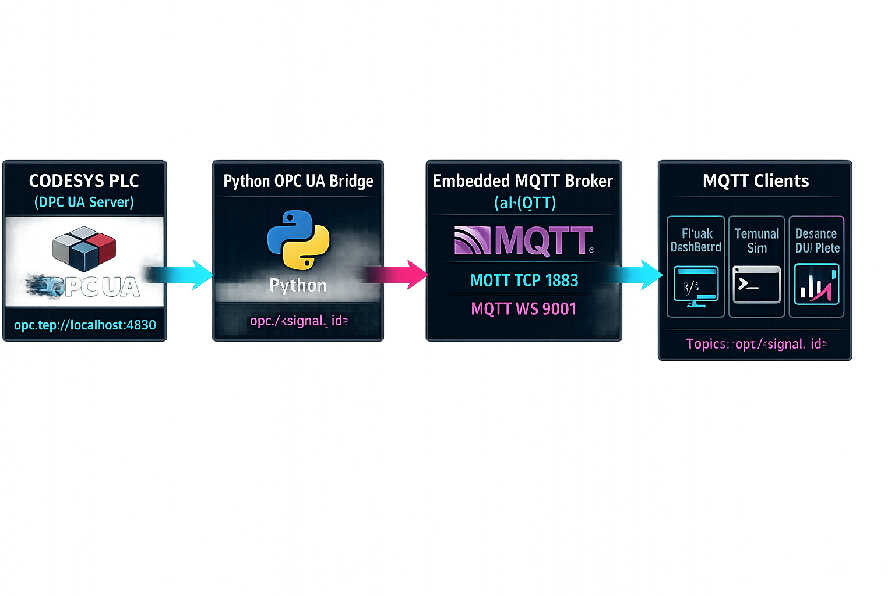
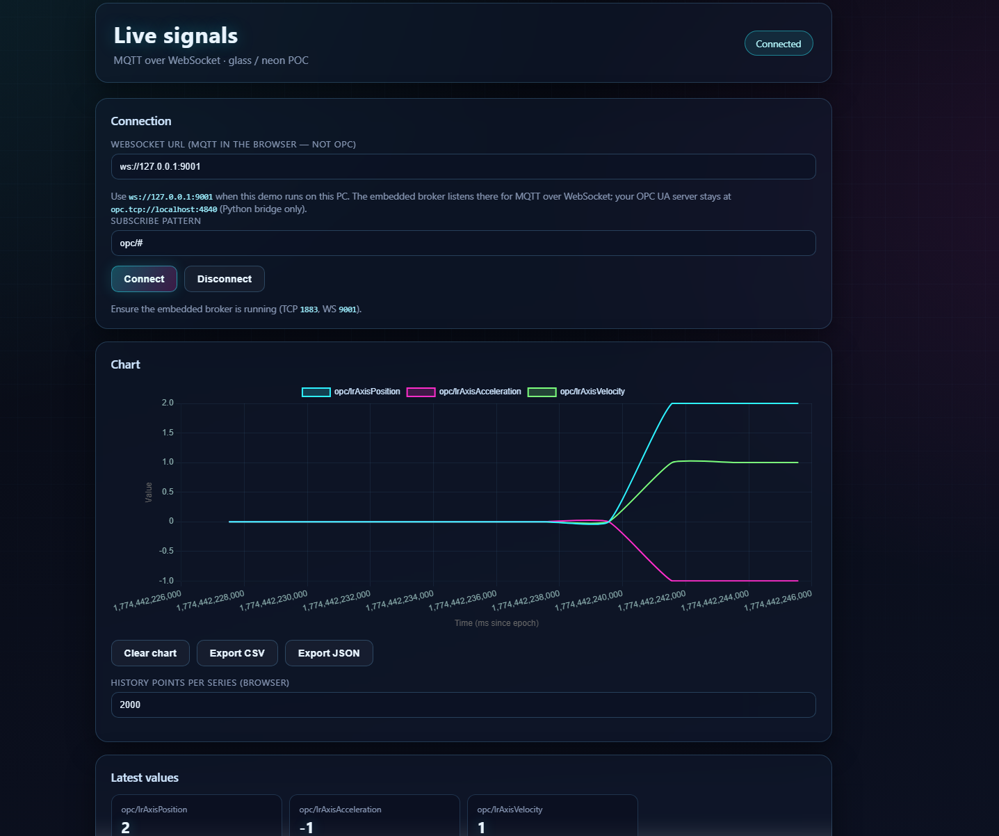
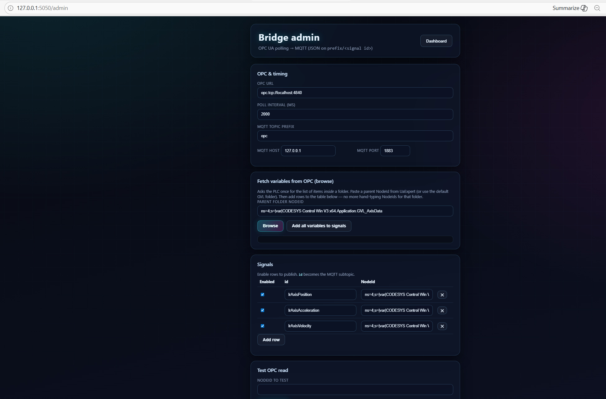
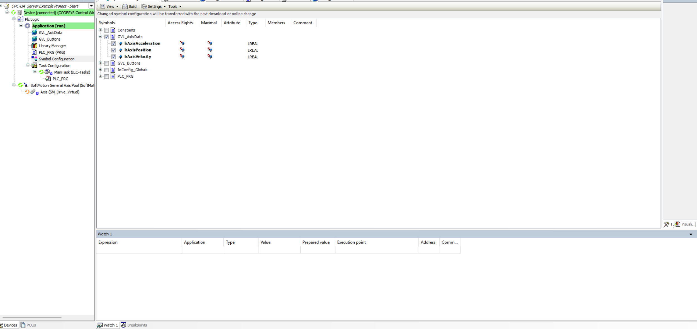
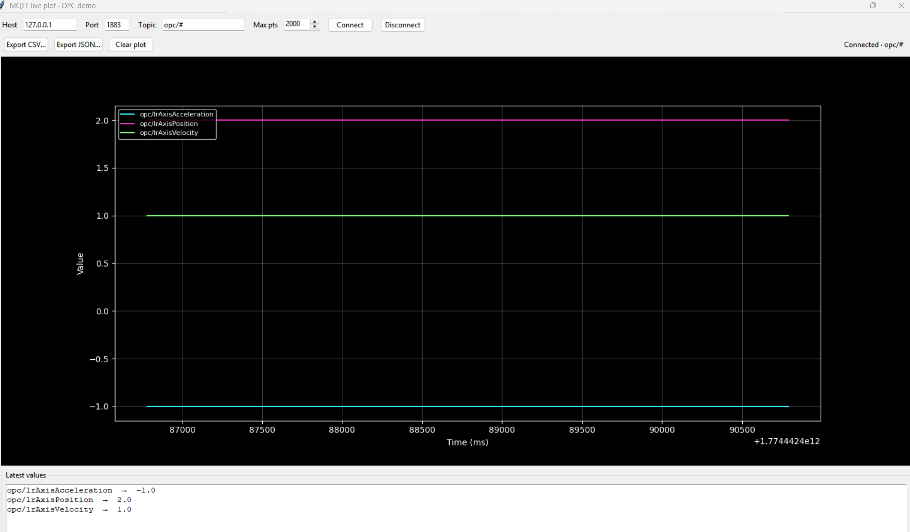

# CODESYS OPC UA -> OPC UA Client with MQTT Broker Integration -> Real-time Dashboard (Community Demo)

[](#)
[](#)
[](#)
[](LICENSE)

## Overview

This repository is a community-friendly proof-of-concept pipeline:

1. CODESYS PLC exposes variables via OPC UA
2. A Python bridge reads OPC UA nodes and publishes JSON messages to MQTT
3. An embedded MQTT broker (aMQTT) serves MQTT to multiple clients
4. A Flask web UI subscribes over MQTT (WebSocket) and plots live charts
5. Optional MQTT clients (terminal + desktop GUI) subscribe and plot/export


## Architecture

High-level flow:
- **CODESYS PLC** exposes variables via **OPC UA**
- **Python bridge** reads configured nodes and publishes JSON to MQTT topics in the form `opc/<signal_id>`
- An embedded **MQTT broker (aMQTT)** distributes messages to all subscribers
- **Flask dashboard** subscribes via MQTT over WebSocket and renders live charts + export
- Optional **terminal/desktop MQTT clients** subscribe over MQTT TCP and plot/export locally

### Flask Dashboard (Live Plot)

*Flask dashboard live chart (subscribing to MQTT over WebSocket).*

### Bridge Admin (OPC UA Browse + Config)

*Bridge admin page for browsing OPC UA nodes and configuring which variables to publish.*

### CoDeSys Symbol Configuration

*CoDeSys symbol/configuration exposing variables (e.g., `GVL_AxisData`) for OPC UA access.*

### Terminal MQTT Simulator

*Terminal MQTT subscriber printing JSON payloads.*

## Default endpoints / topic format

- OPC UA server (used by the Python bridge): `opc.tcp://localhost:4840`
- Embedded MQTT broker (in this demo):
  - MQTT TCP: `127.0.0.1:1883`
  - MQTT WebSocket (browser): `127.0.0.1:9001`
- MQTT topics published by the bridge:
  - `opc/<signal_id>`
- Example JSON payload:
  - {"ts": 1710000000000, "id": "lrAxisPosition", "node_id": "ns=4;s=...", "value": 12.34}

## 1) CoDeSys Project Setup

Copy/paste instructions for the CoDeSys OPC UA server example.

1. Download/obtain the original project from this repository's included `CoDeSys/` folder.
2. Open Project: Open the `CoDeSys_Projects/OPC-UA_Server Example Project - Start.project` in your CoDeSys Development System.
   - This project contains a simple program (`PLC_PRG`) controlling a virtual SoftMotion axis (`Axis1`) and a Global Variable List (`OPC_GVL`) to hold data for OPC UA.
3. (Follow Video for Setup): The video tutorial walks through these steps using the Start project: [YouTube video](https://www.youtube.com/watch?v=E9dnnb-EgZ4)
   - Symbol Configuration: Adding a 'Symbol Configuration' object, building the project, selecting `GVL_AxisData` (or specific variables inside it) for exposure, and enabling "Support OPC UA features".
   - Disable OPC UA Authentication: Double-clicking 'Device', going to the 'Communication Settings' tab, clicking on 'Device', and then on 'Change Runtime Security Policy' checking 'Allow anonymous login'. Note the endpoint URL (usually `opc.tcp://localhost:4840`).
   - Reference Project: `OPC-UA_Server Example Project - Complete.project` has the Symbol Configuration and OPC UA server already set up for comparison.
4. Run Simulation:
   - Start the local PLC (Right Click on CoDeSys tray -> Start PLC).
   - Login (Online -> Login).
   - Create user authentication and login if prompted.
   - Download the project if prompted.
   - Start the PLC (Debug -> Start or F5).
   - You can manually toggle variables like `StartButton` or `StopButton` in `PLC_PRG` to see the simulated axis move and `GVL_AxisData.lrAxisPosition` update.

Note: the device name string inside your NodeIds may differ from the simulation default. Use the admin page's browse feature to pick the correct NodeIds.

## 2) Run the demo (Flask + embedded broker + OPC->MQTT bridge)

1. Create venv + install dependencies

```bash
python -m venv .venv
.
.venv\Scripts\activate
pip install -r requirements-demo.txt
```

2. Start the demo

```bash
python demo_poc\run.py
```

3. Open the UI

- Dashboard: http://127.0.0.1:5050/
- Bridge admin: http://127.0.0.1:5050/admin

On the dashboard:
- WebSocket URL: ws://127.0.0.1:9001
- Subscribe pattern: opc/#

On the admin page:
- Use "Fetch variables from OPC (browse)" and then "Save & restart bridge".

## 3) MQTT client options

With the demo running:

### Terminal MQTT simulator

```bash
python demo_poc\mqtt_sim_client.py
```

### Desktop GUI (plots + export)

```bash
python demo_poc\mqtt_gui_client.py
```

Both subscribe to MQTT TCP `127.0.0.1:1883` and default topic filter `opc/#`.

## Roadmap / TODO

- [ ] Test MQTT auth / credentials end-to-end (broker + clients)
- [ ] Test on real PLC hardware (not only simulation)
- [ ] Add more GVL folders/symbols, re-browse and re-test the bridge
- [ ] Harden MQTT transport (TLS if you expose beyond localhost)

## 📃 License
This project is licensed under the MIT License. Feel free to use, modify, and distribute.

## 🙏 Acknowledgements
- [mn-automation-academy/tutorial-codesys-opc-ua-with-python](https://github.com/mn-automation-academy/tutorial-codesys-opc-ua-with-python)

## 📧 Contact
For any questions, suggestions, or feedback, please reach out:

- Email: nszeeshankhalid@gmail.com
- GitHub: https://github.com/manxlr
